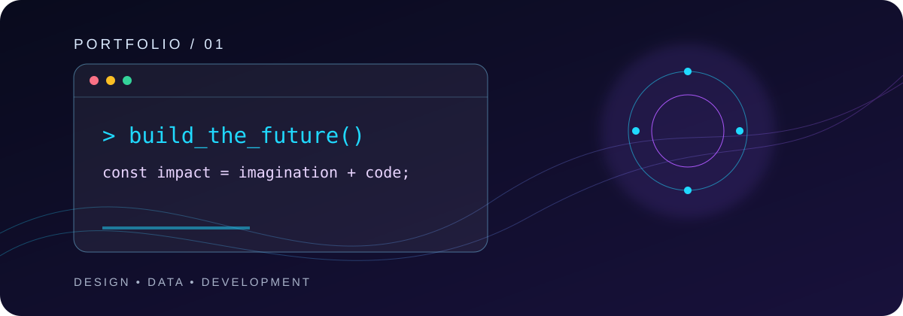
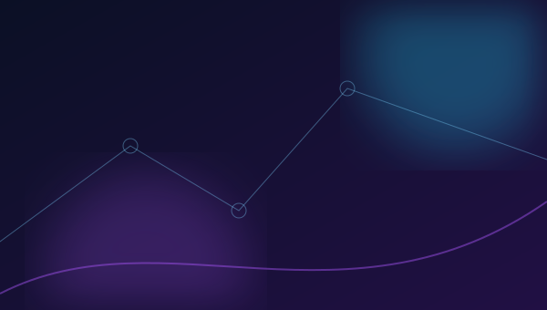
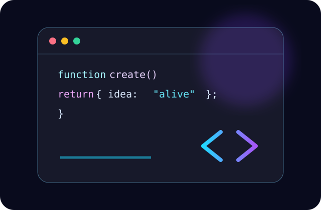
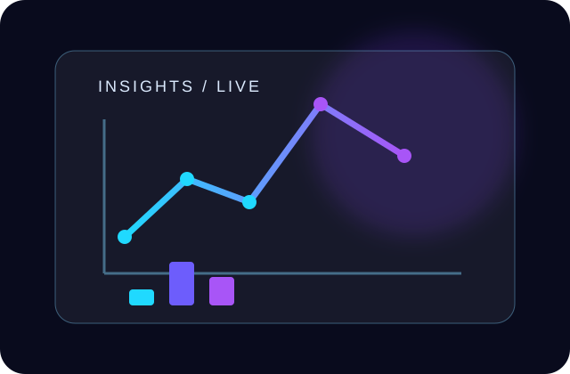
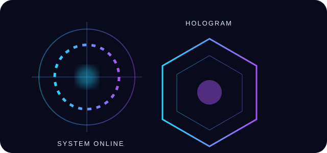

<!-- PROFILE README · satyam07july-png -->

<div align="center">
  
  <br />
  
  <br /><br />
  <a href="https://github.com/satyam07july-png?tab=followers"></a>
  <a href="https://komarev.com/ghpvc/?username=satyam07july-png"></a>
  <a href="https://www.linkedin.com/in/divyanshu-mishra-52bb403a7/"></a>
</div>

<div align="center">

[](mailto:satyammishra07july@gmail.com)
[](#contact)
[](mailto:satyammishra07july@gmail.com?subject=Resume%20request)

</div>

<!-- ABOUT -->
## `> about_me`


I'm **Divyanshu Mishra**, an AI engineer, software developer, data scientist, and data analyst who turns ideas into useful, data-informed products. I enjoy the whole path from clean interfaces and dependable APIs to LLM-powered workflows, data science, analytics, and deployment.

- **Current focus:** AI applications, agentic workflows, RAG, education technology, and automation.
- **What I build:** Full-stack platforms, dashboards, CRM/LMS systems, AI copilots, and decision-support tools.
- **Direction:** Grow into a product-minded AI engineer who ships secure, scalable systems with measurable impact.

<br clear="right" />

<!-- SKILLS -->
## `> capability_matrix`

<div align="center"></div>

<table>
<tr><td valign="top" width="50%">

### Core engineering
`Python` `JavaScript` `TypeScript` `SQL` `C++`  
`React` `Next.js` `Tailwind CSS` `HTML` `CSS` `Vite`  
`Node.js` `Express` `FastAPI`  
`PostgreSQL` `MongoDB` `MySQL` `Firebase`

</td><td valign="top" width="50%">

### AI, data & delivery
`OpenAI` `LangChain` `ChromaDB` `Ollama` `TensorFlow` `PyTorch`  
`Scikit-learn` `Pandas` `NumPy`  
`Power BI` `Excel` `Statistics` `Business Intelligence`  
`Docker` `Linux` `Git` `GitHub` `Vercel` `Render`

</td></tr>
</table>

### Skill signal

```text
Python & data workflows  ████████████████████  90%
Full-stack development   ██████████████████░░  85%
AI / LLM applications    █████████████████░░░  80%
Analytics & BI           ████████████████░░░░  75%
Cloud & DevOps           ████████████░░░░░░░░  60%
```

<!-- PROJECTS -->
## `> selected_builds`

> Project links below are safe placeholders until their repositories, demos, and docs are published.

<table>
<tr>
<td width="50%"><br />
<b>Education CRM + LMS</b><br />A role-based education platform for leads, learners, counsellors, reporting, and course operations.<br /><br />
<code>React</code> <code>Node.js</code> <code>PostgreSQL</code> <code>Tailwind</code><br /><br />
<a href="https://github.com/satyam07july-png?tab=repositories">GitHub</a> · <a href="#selected_builds">Live demo</a> · <a href="#selected_builds">Docs</a></td>
<td width="50%"><br />
<b>AI Resume Analyzer</b><br />An ATS-oriented resume analysis experience with parsing, scoring, and actionable AI feedback.<br /><br />
<code>Python</code> <code>OpenAI</code> <code>NLP</code> <code>Streamlit</code><br /><br />
<a href="https://github.com/satyam07july-png?tab=repositories">GitHub</a> · <a href="#selected_builds">Live demo</a> · <a href="#selected_builds">Docs</a></td>
</tr><tr>
<td><br />
<b>Credit Card Fraud Detection</b><br />Explainable classification and dashboarding for identifying anomalous transactions.<br /><br />
<code>Python</code> <code>Scikit-learn</code> <code>Pandas</code> <code>SHAP</code><br /><br />
<a href="https://github.com/satyam07july-png?tab=repositories">GitHub</a> · <a href="#selected_builds">Live demo</a> · <a href="#selected_builds">Docs</a></td>
<td><br />
<b>Affiliate Management Software</b><br />A portal for affiliate onboarding, referral attribution, administration, and insights.<br /><br />
<code>React</code> <code>Node.js</code> <code>PostgreSQL</code><br /><br />
<a href="https://github.com/satyam07july-png?tab=repositories">GitHub</a> · <a href="#selected_builds">Live demo</a> · <a href="#selected_builds">Docs</a></td>
</tr><tr>
<td><br />
<b>Fitvora</b><br />A modern healthy-protein kitchen experience for customers, orders, and operations.<br /><br />
<code>React</code> <code>Node.js</code> <code>MongoDB</code><br /><br />
<a href="https://github.com/satyam07july-png?tab=repositories">GitHub</a> · <a href="#selected_builds">Live demo</a> · <a href="#selected_builds">Docs</a></td>
<td><br />
<b>Attendance Management System</b><br />An employee attendance workflow with admin controls, reports, and dashboards.<br /><br />
<code>React</code> <code>Express</code> <code>MySQL</code><br /><br />
<a href="https://github.com/satyam07july-png?tab=repositories">GitHub</a> · <a href="#selected_builds">Live demo</a> · <a href="#selected_builds">Docs</a></td>
</tr><tr>
<td><br />
<b>HR Employee Attrition Analysis</b><br />Business intelligence analysis for surfacing retention patterns and risks.<br /><br />
<code>Power BI</code> <code>Excel</code> <code>Statistics</code><br /><br />
<a href="https://github.com/satyam07july-png?tab=repositories">GitHub</a> · <a href="#selected_builds">Live demo</a> · <a href="#selected_builds">Docs</a></td>
<td><br />
<b>Retail Forecast Dashboard</b><br />A data story for sales performance, trends, and forecast-led retail decisions.<br /><br />
<code>Power BI</code> <code>SQL</code> <code>Forecasting</code><br /><br />
<a href="https://github.com/satyam07july-png?tab=repositories">GitHub</a> · <a href="#selected_builds">Live demo</a> · <a href="#selected_builds">Docs</a></td>
</tr><tr><td colspan="2"><br />
<b>AI Voice Assistant</b> — Voice-enabled assistant experiments combining natural-language interaction, automation, and AI services.<br /><br />
<code>Python</code> <code>OpenAI</code> <code>Speech</code> <code>Automation</code><br /><br />
<a href="https://github.com/satyam07july-png?tab=repositories">GitHub</a> · <a href="#selected_builds">Live demo</a> · <a href="#selected_builds">Docs</a></td></tr>
</table>

<!-- ANALYTICS -->
## `> github_telemetry`

<div align="center">
  
  
  <br />
  
  <br />
  
  <br />
  
</div>

### Contribution snake
<picture><source media="(prefers-color-scheme: dark)" srcset="https://raw.githubusercontent.com/satyam07july-png/satyam07july-png/output/github-contribution-grid-snake-dark.svg" /></picture>

<!-- EXPERIENCE -->
## `> experience`

| Period | Role | Impact |
| :-- | :-- | :-- |
| **Now** | **AI & Software Developer · Dizital Adda** | Builds full-stack applications, AI-powered tools, APIs, dashboards, and data-backed workflows. |
| **Next** | **AI product engineering** | Deepening expertise in agentic systems and reliable production AI. |

<!-- EXPERTISE -->
## `> intelligence_stack`

| AI expertise | Data analytics |
| :-- | :-- |
| Prompt engineering · LLMs · RAG · embeddings · vector databases · LangChain · OpenAI · AI agents · automation · MCP · LangGraph | Excel · Power BI · SQL · statistics · forecasting · dashboards · business analytics · data cleaning · visualization |

### Currently learning

`Agentic AI` · `Kubernetes` · `AWS` · `Docker` · `LangGraph` · `Multi-Agent Systems` · `MCP`

<!-- CREDENTIALS -->
## `> credentials_and_milestones`

| Certification focus | Achievement |
| :-- | :-- |
| **Data Science · Python · SQL · Power BI** | Turning raw information into clear, decision-ready analysis. |
| **AI Development · Software Development** | Shipping practical systems across the AI and web stack. |
| **Next milestone** | Build reliable, human-centered AI agents that earn user trust. |

<!-- CONTACT -->
## `> contact`

<div align="center">
  <a href="https://github.com/satyam07july-png"></a>
  <a href="https://www.linkedin.com/in/divyanshu-mishra-52bb403a7/"></a>
  <a href="mailto:satyammishra07july@gmail.com"></a>
</div>

<div align="center"><br />
  
  <br />
  <i>“Code with purpose. Build with curiosity. Learn without limits.”</i><br /><br />
  
</div>
